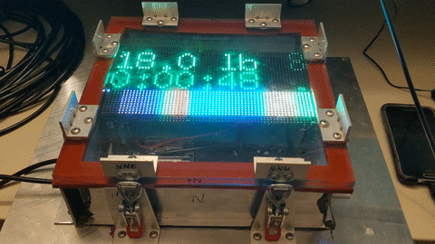
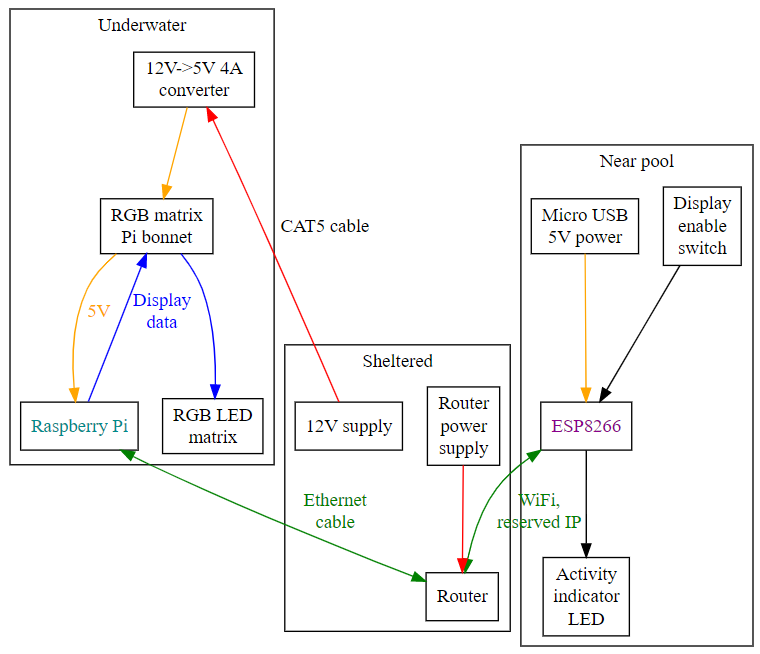

# poolmonitor

Make your own pool treadmill!

This repository contains a set of software to monitor a load cell and report
current force, duration of pulling session, and force history via an RGB LED
matrix.  The load cell is to be attached to a bungee cord to which a swimmer
will be harnessed, and the RGB matrix is placed underwater to be easily visible
to the swimmer.

## Architecture

An ESP8266 monitors the load cell via an HX711 load cell amplifier and exposes
a standard webserver which responds to polls with JSON describing the current
and recent state of the load cell.  The software for the ESP8266 is an Arduino
sketch located in [load_cell_server_esp8266](load_cell_server_esp8266).

A Raspberry Pi drives a 64x32 RGB matrix using an
[Adafruit RGB Matrix Bonnet for Raspberry Pi](https://www.adafruit.com/product/3211)
and obtains the data to do so by polling the ESP8266 server.  Connectivity is
provided by attaching the Pi to a router via Ethernet cable, and having the
ESP8266 connect to that router as well with an IP address reservation.  Power
is provided to the Pi and RGB matrix down in the water via a second Ethernet
cable that is used only to conduct 12 V power into the waterproof box.  The
software for the Pi is a Python application located in
[display_driver](display_driver).

## Usage
The ESP8266 turns on its activity LED when it is powered on, and then turns it
back off after the server is intialized and ready to receive requests (usually
about 5 seconds).  The LED is turned on while serving a request, which is
usually just a flash.  The ESP8266 can be powered off without any additional
steps.

The Pi can query the state of the toggle switch on the ESP8266 and the Pi uses
that information to turn the RGB matrix on or off.  The switch is connected to
a pin on the ESP8266 that controls programming, however, and **the switch must be
in the off position to boot up or program the ESP8266**.

The Raspberry Pi is a real computer and takes tens of seconds to boot up.  Also,
it should be gracefully shut down using
[RaspController](https://play.google.com/store/apps/details?id=it.Ettore.raspcontroller)
or a similar tool before removing power to avoid corruption.
